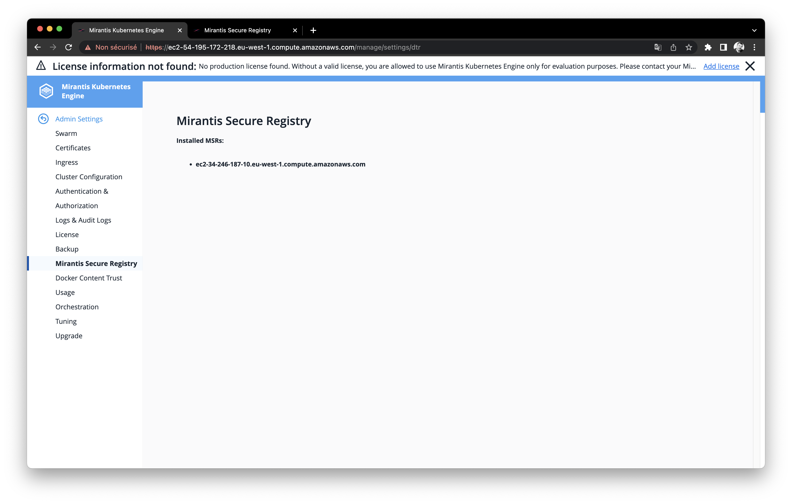

# Mirantis Container Platform

<br>

<br><br>

This project aims to test the **Mirantis Container Platform** solution composed of:
- [MKE: Mirantis Kubernetes Engine](https://docs.mirantis.com/mke/3.5/overview.html)
- [MCR: Mirantis Container Runtime](https://docs.mirantis.com/mcr/20.10/overview.html)
- [MSR: Mirantis Secure Registry](https://docs.mirantis.com/msr/3.0/overview.html)

As a reminder, this solution is based on the former **Docker EE** (Enterprise Edition) solution that Mirantis acquired in 2019.
This container platform is also the only one able to manage both **Swarm** and **Kubernetes** container orchestration.

<br>

## Create lab on AWS

For this lab we will provision resources on [AWS](https://aws.amazon.com) with [Terraform](https://www.terraform.io/).

Follow [this guide](terraform/README.md) to provision everything we need with the embedded Terraform project.

<br>

## Install Mirantis Kubernetes engine

Now that the infrastructure is provisioned, we can start the  installation of Mirantis components. 
First, check [the Mirantis official documentation](https://www.mirantis.com/download/mirantis-cloud-native-platform/mirantis-kubernetes-engine/) to understand the process.

Install [the launchpad CLI](https://github.com/Mirantis/launchpad/releases) from the latest release.

Check that the `launchpad.yaml` file is present in the root directory of the project. Terraform generated it during provisioning using [a template](./terraform/mirantis.tf). 

Look at the content of the file to see what's in it and make sure it matches your environment. Otherwise, go back to [the provisioning guide](terraform/README.md) to adapt the configuration and update infrastructure.

Then start the installation using launchpad:

```bash
$ launchpad apply
```

If everything goes well you must have something like that at the end of the execution:

```bash
INFO Cluster is now configured.                   
INFO MKE cluster admin UI: https://ec2-52-17-170-180.eu-west-1.compute.amazonaws.com/ 
INFO MSR cluster admin UI: https://ec2-52-215-236-184.eu-west-1.compute.amazonaws.com/ 
INFO You can download the admin client bundle with the command 'launchpad client-config' 
```

> If you get some error at this step, you have to resolve it before moving on. 

Access the MKE web console using the credentials you configured in the `launchpad.yaml` file. If you have a license you can configure it at this step, otherwise select the `Skip for now` option.


Access the MSR web console:


Check the MKE cluster nodes in `Shared resources > Nodes`:


> **Notes:** Nodes are shared resources because they are used both for Swarm and Kubernetes orchestration.

Chek also that the MSR registry is well integrated with MKE in `Admin Settings > Mirantis Secure Registry`:



> **Notes:** The column `type` indicates the type of orchestration supported on the node. Manager nodes are always of `Mixed` type. But we can choose between `Swarm`, `Kubernetes` or `Mixed` for worker nodes.