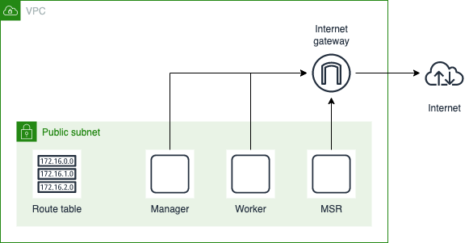

# Create infrastructure

We are using Terraform to provision infrastructure on AWS.

&nbsp;&nbsp;&nbsp;&nbsp; 

## Requirements

- Terraform
- AWS credentials
- AWS Keypair existing with the corresponding private key on your local machine

Export your AWS credential as environment variable.

## Configuration



By default, the project configure a cluster with one node per role:
- manager
- worker
- mcr

You need to configure the Terraform project's variables according your needs and the environment you want to create. 
For that, you can adapt variables contained in the `variables.tf` file or supercharge them in a `*.tfvars` file. 

> Check [this  documentation](https://www.terraform.io/language/values/variables) if your are not aware of variables management in Terraform.

## Provisionning

Execute the Terraform project:

```hcl
cd terraform/
terraform init
terraform apply
```

Check that the file Mirantis configuration file has been generated in the project root directory `../launchpad.yaml`.

> Note: The security group is configured to accept all connections for all protocols but only from your current public IP. If your location changes you must execute `terraform apply` in order to update it.

## Test

You can test SSH connection on every node described in the `launchpad.yaml` with the user `ubuntu` to verify you can connect without password. 

It will confirm that everything is well configured between the AWS keypair and the local private SSH key you are using.